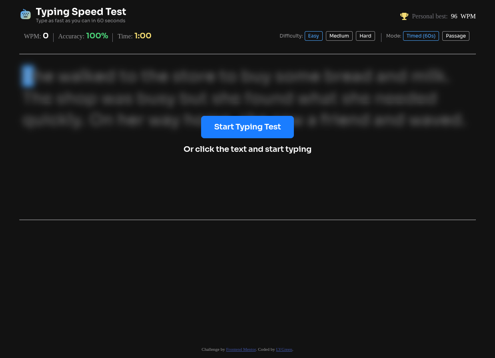
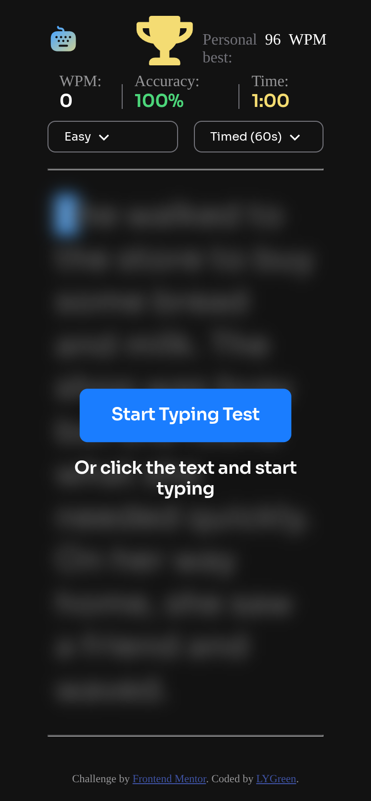

# Frontend Mentor - Typing Speed Test solution

This is a solution to the [Typing Speed Test challenge on Frontend Mentor](https://www.frontendmentor.io/challenges/typing-speed-test). Frontend Mentor challenges help you improve your coding skills by building realistic projects. 

## Table of contents

- [Overview](#overview)
  - [The challenge](#the-challenge)
  - [Screenshot](#screenshot)
  - [Links](#links)
- [My process](#my-process)
  - [Built with](#built-with)
  - [What I learned](#what-i-learned)
  - [Continued development](#continued-development)
- [Author](#author)
- [Acknowledgments](#acknowledgments)

## Overview

### The challenge

Users should be able to:

- View the optimal layout for the interface depending on their device's screen size
- See hover and focus states for all interactive elements on the page

### Screenshot

### Links

- Solution URL: [Solution URL](https://www.frontendmentor.io/solutions/typing-speed-test-made-using-html-css-and-javascript-hAZzrAPzk_)
- Live Site URL: [Live Site URL](https://lygreen.github.io/fm-typing-speed-test)

## My process

### Built with

- Semantic HTML5 markup
- CSS custom properties
- Flexbox
- CSS Grid
- Mobile-first workflow
- Javascript

### What I learned

I learned how to implement a custom-styled typing box, including handling user input, cursor behavior, and focus states. I also learned how to use requestAnimationFrame to manage smooth animations and synchronize rendering with the browser’s refresh cycle, improving performance compared to traditional timer-based approaches.

### Continued development

In future projects, I want to continue focusing on translating design mockups into functional interfaces with high fidelity. I aim to refine my skills in accurately implementing spacing, typography, and visual hierarchy as outlined in the designs. Additionally, I want to improve my workflow for converting design components into reusable code patterns, ensuring consistency and efficiency across projects.

## Author

- Frontend Mentor - [@LYGreen](https://www.frontendmentor.io/profile/LYGreen)
